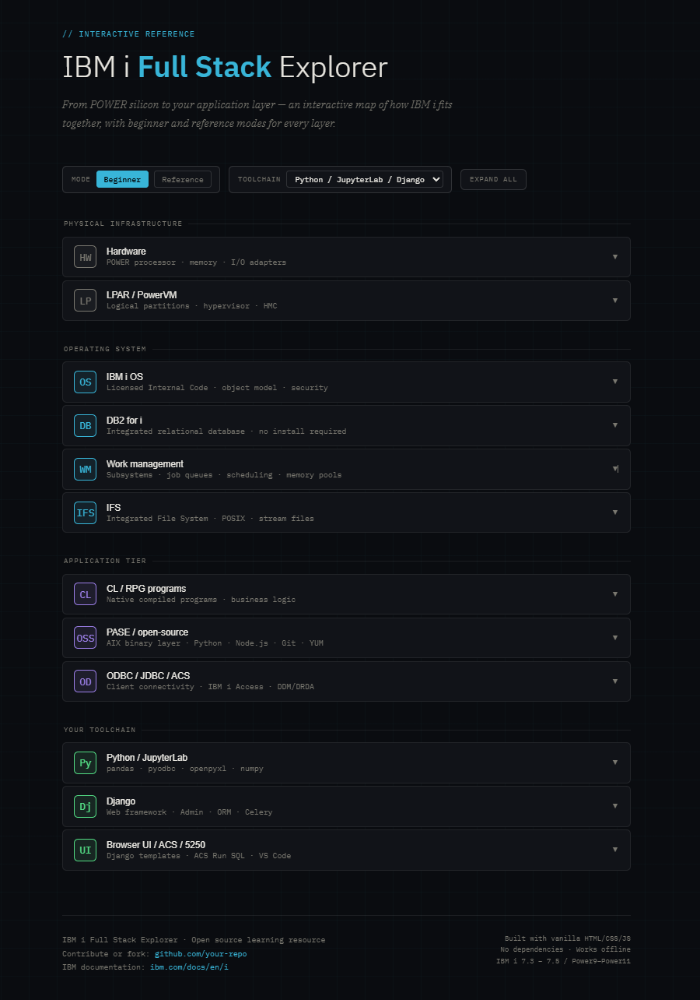

# IBM i Full Stack Explorer

An interactive, single-file reference tool that maps the IBM i (AS/400) platform from POWER silicon to your application layer — with beginner and reference modes for every layer.



> **Live demo:** [BlancuzziJ.github.io/ibmi-stack-explorer](https://BlancuzziJ.github.io/ibmi-stack-explorer)

---

## What is this?

IBM i is one of the most misunderstood platforms in enterprise computing. Its layered architecture — from POWER processors through the OS, DB2, work management, PASE open-source runtime, and up to modern Python/Node.js toolchains — is rarely documented in a way that's accessible to newcomers or useful as a quick reference for practitioners.

This tool aims to fix that. Every layer is expandable with:

- **Beginner mode** — plain-English explanations, no assumed knowledge
- **Reference mode** — concise technical details for practitioners
- **Tags** — key technologies and terms at a glance
- **Ask Claude** — pre-filled prompt to dive deeper with AI
- **IBM Docs** — direct link to official documentation

---

## Features

| Feature | Description |
|---|---|
| 12 layers | Hardware → LPAR → OS → DB2 → Work Mgmt → IFS → CL/RPG → PASE → ODBC → Toolchain |
| Dual mode | Toggle between Beginner and Reference descriptions per layer |
| 3 toolchain presets | Python/JupyterLab/Django · Node.js/Express/React · Custom |
| Custom toolchain | Enter your own tools — swaps the top 3 layers live |
| Expand all | One click to open every layer at once |
| Zero dependencies | Single HTML file, works offline, no npm, no build step |
| Dark theme | IBM Plex fonts, clean dark UI |

---

## Usage

### Option 1 — Open locally (no server needed)

```bash
git clone https://github.com/BlancuzziJ/ibmi-stack-explorer.git
cd ibmi-stack-explorer
open index.html        # macOS
# or
start index.html       # Windows
# or just drag the file into your browser
```

### Option 2 — Visit the hosted version

[BlancuzziJ.github.io/ibmi-stack-explorer](https://BlancuzziJ.github.io/ibmi-stack-explorer)

### Option 3 — Download the file directly

[Download index.html](https://raw.githubusercontent.com/BlancuzziJ/ibmi-stack-explorer/main/index.html) — right-click → Save As, open in any browser.

---

## Publishing your own fork on GitHub Pages

1. Fork this repo
2. Go to **Settings → Pages**
3. Source: **Deploy from a branch** → `main` → `/ (root)`
4. Your live URL: `https://yourusername.github.io/ibmi-stack-explorer`

No build process, no workflow file needed — GitHub Pages serves the HTML directly.

---

## Customizing the toolchain

The top group of three layers ("Your toolchain") is swappable. Built-in presets:

- **Python / JupyterLab / Django** — analytics + web framework + browser UI
- **Node.js / Express / React** — REST API + SPA front end
- **Custom** — type in your own tool names and descriptions

To add a new preset permanently, edit the `STACKS` object in `index.html`:

```javascript
const STACKS = {
  python: { ... },
  node:   { ... },
  // Add yours here:
  java: {
    analytics: {
      name: 'Java / Spring Boot',
      sub:  'JPA · DB2 JDBC · Maven',
      icon: 'Jv',
      color: '#e05c4b',
      tags: ['Java 17', 'Spring Boot', 'JPA', 'JDBC', 'Maven'],
      beginner: '...',
      reference: '...',
      docs: 'https://spring.io/projects/spring-boot',
      claude: 'How do I connect Spring Boot to IBM i DB2 using JDBC?'
    },
    framework: { ... },
    ui:        { ... }
  }
};
```

Then add your key to the `<select>` dropdown in the HTML.

---

## Adding or editing layers

Each core layer follows this structure in the `CORE_LAYERS` array:

```javascript
{
  id:        'unique-id',
  name:      'Layer name',
  sub:       'Short subtitle · fits one line',
  icon:      'XX',          // 2-char abbreviation shown in the icon box
  color:     '#hexcolor',   // accent color for this layer
  tags:      ['Tag1', 'Tag2', ...],
  beginner:  'Plain English explanation...',
  reference: 'Technical reference details...',
  docs:      'https://link-to-ibm-docs',
  claude:    'Pre-filled prompt for Ask Claude button'
}
```

---

## Contributing

Contributions are welcome — see [CONTRIBUTING.md](CONTRIBUTING.md) for guidelines.

Quick ways to help:
- Fix or improve a layer description (beginner or reference mode)
- Add a new toolchain preset
- Add a new layer (e.g. IBM MQ, Db2 Mirror, HA/DR)
- Translate descriptions to another language
- Add a screenshot or demo GIF to the README

---

## IBM i version coverage

This tool covers IBM i **7.3, 7.4, and 7.5** running on **Power9, Power10, and Power11** hardware. Older versions (7.2 and below) are not covered but many concepts still apply.

---

## License

MIT — see [LICENSE](LICENSE)

---

## Acknowledgements

Built with:
- [IBM Plex fonts](https://www.ibm.com/plex/) (open source, SIL OFL license)
- Vanilla HTML, CSS, and JavaScript — no frameworks, no build tools

IBM i, AS/400, POWER, DB2, and related names are trademarks of IBM Corporation. This project is not affiliated with or endorsed by IBM.
